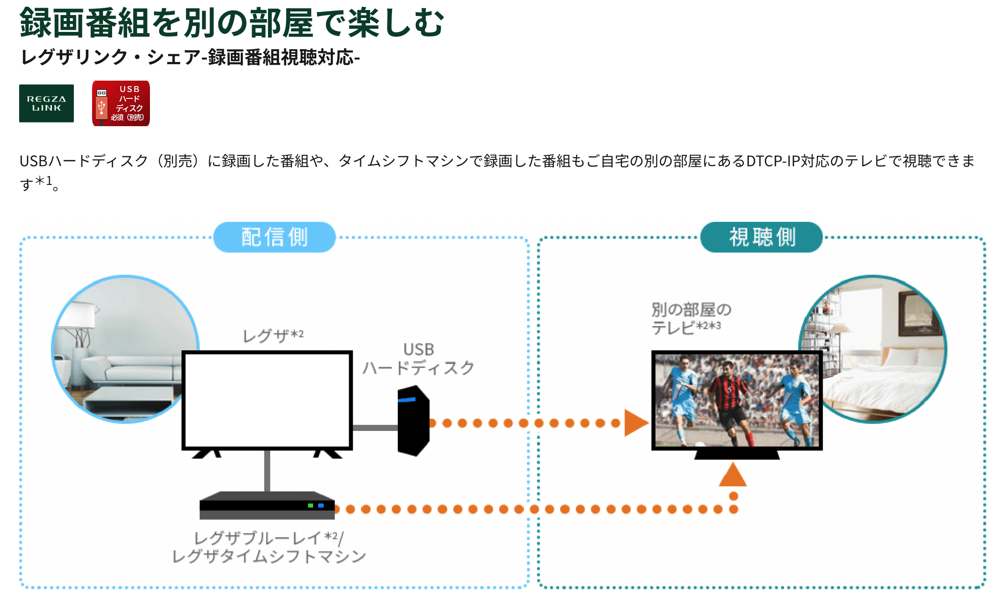

# mUPnP for C


[](https://github.com/cybergarage/mupnp/actions/workflows/make.yml)
[](http://cybergarage.github.io/mupnp/)

**mUPnP for C**is a development package for UPnP™ developers. mUPnP
controls these protocols automatically, and supports to create your
devices and control points quickly.

UPnP™ \* architecture is an open network to enable discovery and control
of networked devices and services, such as media servers and players at
home.

UPnP™ \* protocols are based on many standard, such as GENA, SSDP, SOAP,
HTTPU and HTTP. Therefore you have to understand and implement these
protocols to create your devices of UPnP™.


**mUPnP for C**is supported from IPA, INFORMATION-TECHNOLOGY PROMOTION
AGENCY, JAPAN, as a project of MitohProgram2004.

\* UPnP ™ is a certification mark of the UPnP™ Implementers Corporation.

## Building and Installation

### Homebrew (macOS, Linux, Raspbian)

For any platforms which support [Homebrew](https://brew.sh/), you can easily install using Homebrew with the following `brew` commands:

```
brew tap cybergarage/homebrew
brew install mupnp
```

### Installation from source

**mUPnP for C**is distributed as an Automake project, and so you can install the library from the source codes with the following commands:

```
./configure
make install
```

## References

### mUPnP for C

To develop UPnP devices or control point applications using **mUPnP for C**, please check the following developer's documentation.

* [Programming Guide](doc/mupnpcproguide.pdf)
* [Doxygen](http://cybergarage.github.io/mupnp/)

### mUPnP for Objective-C

**mUPnP for C**releases the wrapper library for Objective-C to use the UPnP library on iOS and MacOSX platforms too. Please check the following developer's documentation to know the wrapper library in more detail.

* [Programming Guide](doc/mupnpobjcproguide.pdf)
* [Doxygen](http://cybergarage.github.io/mupnp/objc/html/)

## Examples

- UPnP control point examples
  - UPnP controller for UPnP devices
    - [UPnP multicast dump utility](examples/upnpdump)
  - UPnP controller for UPnP stardard devices
    - [UPnP Internet gateway utility ](examples/upnpigddump)
    - [UPnP/AV media server utility ](examples/upnpavdump)
 
- UPnP device examples
  - UPnP non-standard devices
    - [UPnP clock device](examples/clock)
    
## Adoption of mUPnP in Consumer Products

**mUPnP for C** is used in a variety of consumer products. While not exhaustive, the following is a list of notable implementations.

### Nokia 770 Internet Tablet

Nokia engineers contributed to the improvement of the initial **mUPnP for C** release. Nokia developed the UPnP/AV Control Point application, **Media Streamer**, for the Nokia 770 Internet Tablet.　The application is based on **mUPnP for C**, incorporating custom patches by Nokia.  


### Panasonic VIERA Remote for iOS Devices
The [**VIERA Remote**](http://panasonic.jp/support/global/cs/tv/vremote/index.html) is a TV remote control app for Panasonic VIERA TVs (plasma and LCD models).  It allows users to control channels, switch inputs, and adjust the volume directly from an **iPhone, iPod touch, or iPad** (iOS 4.2 or later). **mUPnP for C** functions as the UPnP framework for this app.  


### Toshiba REGZA Televisions

[**REGZA**](https://www.regza.com/) is Toshiba’s former AV equipment brand.  **mUPnP for C** is embedded in REGZA televisions, enabling seamless media streaming and connectivity.  


