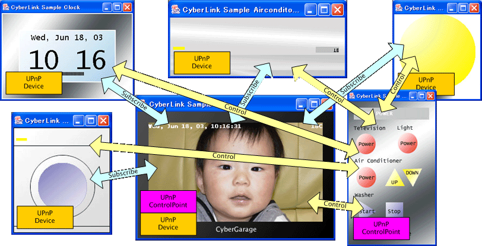
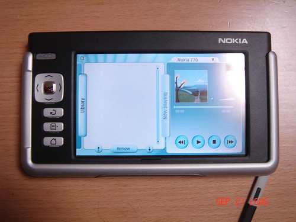
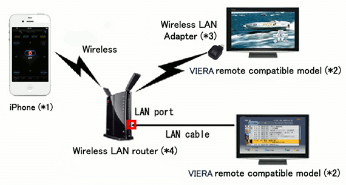
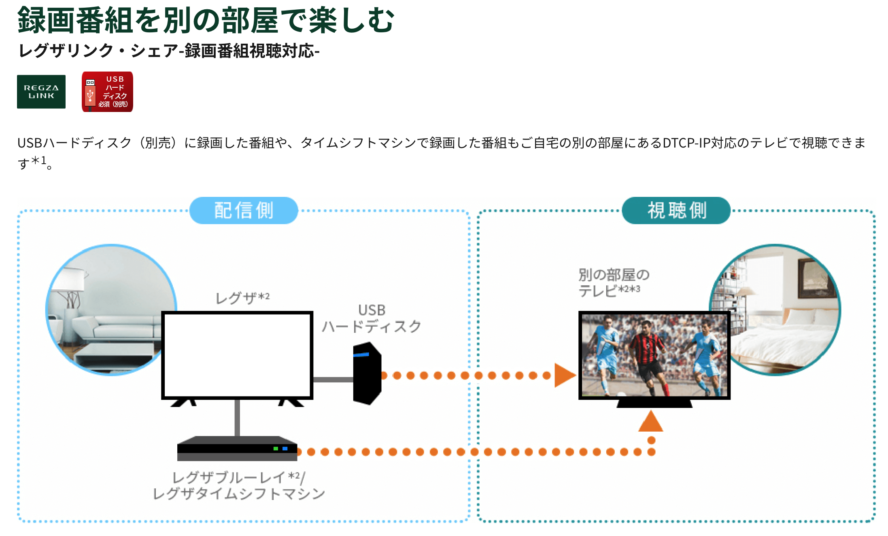

# mUPnP for C


[](https://github.com/cybergarage/mupnp/actions/workflows/make.yml)
[](http://cybergarage.github.io/mupnp/)
[](https://codecov.io/gh/cybergarage/mupnp)

mUPnP for C is a development package for UPnP™ [^1] (Universal Plug and Play) developers. It provides a set of APIs to create UPnP™ devices and control points quickly and easily. This README file provides an overview of the package, its contents, and instructions on how to set up and use it.


The UPnP™ architecture is designed to enable the discovery and control of networked devices and services, such as media servers and players, within a home network. UPnP™ is based on several standard protocols, including GENA, SSDP, SOAP, HTTPU, and HTTP. To create UPnP™ devices, you need to understand and implement these protocols.



mUPnP for C simplifies this process by handling these protocols automatically. It allows developers to focus on creating their devices and control points without worrying about the underlying protocol details.

mUPnP for C runs on Unix-like systems, macOS/iOS, Windows, and, since 3.1.0, on **ESP32 microcontrollers as an ESP-IDF component**.

## What's New in 3.1.1

- **Reliability and security fixes**: bounded HTTP body allocation, working connect/read timeouts for HTTP clients, no leak or use-after-free in device-side GENA subscriptions, and correct LOCATION addresses in SSDP replies.
- **Opt-in IPv6** (experimental) on Linux, macOS and BSD via `mupnp_net_setipv6enabled(true)`.
- State variables expose their SCPD `dataType` and `defaultValue` in C and Objective-C.
- `make distcheck` passes, and CMake options (now `MUPNP_*`) take effect.

See the [ChangeLog](ChangeLog) for details, including a struct change in `mUpnpSocket` that requires rebuilding dependent code.

## What's New in 3.1.0

- **ESP32 / ESP-IDF support**: use mUPnP as an ESP-IDF component on ESP32 (Wi-Fi station, IPv4), with a ready-to-build [Wi-Fi control-point example](examples/espidf/control_point) and an [ESP-IDF guide](doc/espidf.md).
- Reliability fixes found on ESP32 hardware: safe handling of XML allocation failures, GENA subscriptions kept across LOCATION changes, and HTTP server rebinding over TIME_WAIT.
- ESP-IDF v5.5.5 cross-build and host regression tests in CI.
- NULL-safe XML child-node lookups, correct `bool` handling from C++, and Xcode 27 project fixes.

See the [ChangeLog](ChangeLog) for details, including one API change: `mupnp_xml_attributelist_set()` now returns `bool`.

**mUPnP for C** is supported from IPA, INFORMATION-TECHNOLOGY PROMOTION AGENCY, JAPAN, as a project of [Mitoh Program 2004](https://www.ipa.go.jp/archive/jinzai/mitou/mitoipedia/2004shimoki-seika.html#sakamura).

## Building the Library and Samples

To build the library and samples, you need to have the following tools installed on your system:

### Unix

mUPnP for C is distributed as an Automake project, and so you can install the libary from the source codes with the following commands:

```
cd mupnp
./configure
make
```

### Homebrew (macOS, Linux)

For platforms that support [Homebrew](https://brew.sh/), you can easily install using the following `brew` commands:

```
brew tap cybergarage/homebrew
brew install mupnp
```

### MacOSX

For MacOSX, I have released a wrapper class for Objective-C on Cocoa. Currently, the framework supports only basic functions of the control point. Please use the standard C library if you need to use all functions of mUPnP for C.

The bundled Xcode projects build with Xcode 27 and target macOS 12.0 / iOS 15.0 or later.

### ESP32 (ESP-IDF)

The repository can be used directly as an ESP-IDF component with Espressif's
managed Expat dependency. The port targets **ESP32 with one active Wi-Fi station
interface and IPv4**; the build baseline is ESP-IDF v5.5.5 (`>=5.5,<6.0`).

To try the Wi-Fi control-point example:

```
cd mupnp/examples/espidf/control_point
idf.py set-target esp32
idf.py menuconfig   # mUPnP control point example -> Wi-Fi SSID/password
idf.py build
idf.py -p /dev/ttyUSB0 flash monitor
```

To use mUPnP in your own application, place this repository at
`<project>/components/mupnp` (for example, as a Git submodule pinned to the
`3.1.1` tag), add `REQUIRES mupnp` to your component, and include
`<mupnp/upnp.h>`.

Limited control-point hardware testing on an ESP32 DevKitC-VE is reported.
Device hosting, other ESP32-family targets, IPv6, Ethernet, and long-duration
operation have not been validated yet. See the [ESP-IDF guide](doc/espidf.md)
for required `sdkconfig` settings, lifetime and memory notes, and a hardware
validation checklist.

### Windows

For Windows platforms, mUPnP includes platform projects for Visual Studio 2005. Please check the platform directories, mupnp/*/win32/vs2005, to use the projects. On WindowsCE, mUPnP does not have platform projects, but a contributor has verified that the source codes compile normally.

## References

### mUPnP for C

To develop UPnP devices or control point applications using **mUPnP for C**, please check the following developer's documentation.

* [Programming Guide for C](http://cybergarage.github.io/mupnp/)
* [Doxygen](http://cybergarage.github.io/mupnp/)

### mUPnP for Objective-C

**mUPnP for C** releases the wrapper library for Objective-C to use the UPnP library on iOS and MacOSX platforms too. Please check the following developer's documentation to know the wrapper library in more detail.

* [Programming Guide for Objective-C](http://cybergarage.github.io/mupnp/objc/html/)
* [Doxygen](http://cybergarage.github.io/mupnp/objc/html/)

## Examples

- UPnP control point examples
  - UPnP controller for UPnP devices
    - [UPnP multicast dump utility](https://github.com/cybergarage/mupnp/tree/master/examples/upnpdump)
  - UPnP controller for UPnP stardard devices
    - [UPnP Internet gateway utility ](https://github.com/cybergarage/mupnp/tree/master/examples/upnpigddump)
    - [UPnP/AV media server utility ](https://github.com/cybergarage/mupnp/tree/master/examples/upnpavdump)
  - Embedded control point
    - [ESP32 Wi-Fi control point (ESP-IDF)](https://github.com/cybergarage/mupnp/tree/master/examples/espidf/control_point)
 
- UPnP device examples
  - UPnP standard devices
    - [UPnP BinaryLight:1 device](https://github.com/cybergarage/mupnp/tree/master/examples/binarylight)
  - UPnP non-standard devices
    - [UPnP clock device](https://github.com/cybergarage/mupnp/tree/master/examples/clock)
    
## Adoption in Consumer Products

**mUPnP for C** is used in a variety of consumer products. While not exhaustive, the following is a list of notable implementations.

### Nokia 770 Internet Tablet

Nokia engineers contributed to the improvement of the initial **mUPnP for C** release. Nokia developed the UPnP/AV Control Point application, **Media Streamer**, for the Nokia 770 Internet Tablet.　The application is based on **mUPnP for C**, incorporating custom patches by Nokia.  



### Panasonic VIERA Remote for iOS Devices
The [**VIERA Remote**](http://panasonic.jp/support/global/cs/tv/vremote/index.html) is a TV remote control app for Panasonic VIERA TVs (plasma and LCD models).  It allows users to control channels, switch inputs, and adjust the volume directly from an **iPhone, iPod touch, or iPad** (iOS 4.2 or later). **mUPnP for C** functions as the UPnP framework for this app.  



### Toshiba REGZA Televisions

[**REGZA**](https://www.regza.com/) is Toshiba’s former AV equipment brand. **mUPnP for C** is embedded in REGZA televisions, enabling seamless media streaming and connectivity.  



[^1]: UPnP™ is a certification mark of the UPnP™ Implementers Corporation.
