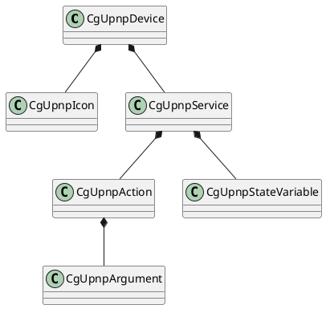
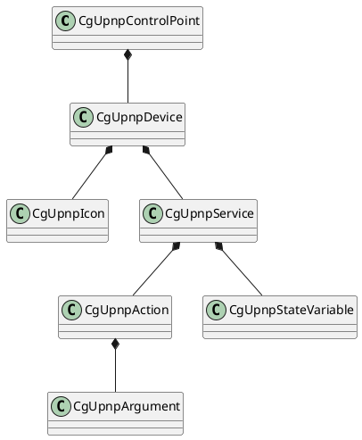

# mUPnP for C Programming Guide Document Version 2.2

# 1 Introduction

UPnP™*[^1] architecture is based on open networking to enable discovery and control of networked devices and services, such as media servers and players at home.

UPnP™ architecture is based on many standard protocols, such as GENA, SSDP, SOAP, HTTPU and HTTP. Therefore you have to understand and implement these protocols to create your devices of UPnP™.

mUPnP for C is a development package for UPnP™ developers. The mUPnP controls these protocols automatically, and supports to create your devices and control points quickly.

Please see the following site and documents to know about UPnP™ in more detail.

| Document                                               | URL                                                                       |
|----------------------------------------------------------|---------------------------------------------------------------------------|
| UPnP™ Forum                                            | http://www.upnp.org/                                                      |
| Universal Plug and Play Device Architecture            | http://www.upnp.org/download/UPnPDA10_20000613.htm                        |
| Universal Plug and Play Vendor\'s Implementation Guide | http://www.upnp.org/download/UPnP_Vendor_Implementation_Guide_Jan2001.htm |

# 2 Setup

## 2.1 Package Contents

The mUPnP package has the header files, the source files, the project files to build the package and the some samples. The files are included the following directories.

| File Type     |                         | Directory             |
|---------------|-------------------------|-----------------------|
| Source files  |                         | mupnp/src            |
| Header Files  |                         | mupnp/include        |
| Sample files  |                         | mupnp/sample         |
| Project files | Unix (Automake)         | mupnp                |
|               | WindowsXP (VisualC 6.0) | mupnp/*/win32/vc60  |
|               | T-Engine (GNU)          | mupnp/*/tengine/gnu |
|               | uITRON                  | mupnp/*/itron       |
|               | MacOSX                  | mupnp/*/macosx      |

## 2.2 System Requirement

The mUPnP needs the following package to parse the XML and SOAP requests. Please get the parser package and install in your platform.

| Package | URL                           |
|---------|-------------------------------|
| Expat   | http://expat.sourceforge.net/ |

### 2.2.1 WindowsXP

On Windows platform, you have to install latest Platform SDK and build on WindowsXP if you can. Please get the SDK and install in your platform.

| Package      | URL                                                        |
|--------------|------------------------------------------------------------|
| Platform SDK | http://www.microsoft.com/msdownload/platformsdk/sdkupdate/ |

### 2.2.2 T-Engine

On T-Engine platform, you have to use the following development kit based on GNU GCC and TCP/IP protocol stack that supports the multicast protocol. The mUPnP uses the multicast protocol to search and announce UPnP devices and you have to use the protocol stack because the old package doesn't support the multicast protocol.

| Package                  | URL                                                          |
|--------------------------|--------------------------------------------------------------|
| T-Engine Development Kit | http://www.personal-media.co.jp/te/welcome.html              |
| KASAGO for T-Engine      | http://www.elwsc.co.jp/japanese/products/kasago_tengine.html |


The mUPnP supports the following TCP/IP protocol stack for T-Engine too, but the protocol stack doesn't support the multicast protocol and the functions are not implemented yet.

| Package         | URL                                             |
|-----------------|-------------------------------------------------|
| PMC T-Shell Kit | http://www.personal-media.co.jp/te/welcome.html |

## 2.3 Building library and samples

The mUPnP supports the following compiler options to change the XML parser or disable UPnP functions. You haven't to set the options when you use Expat as the XML parser and all functions of the mUPnP.

| Option                     |   URL
|----------------------------|-------------------------------------------------|
| CG_XMLPARSER_LIBXML2       | Use libxml2 as the XML parser instead of Expat. |
| CG_UPNP_NOUSE_CONTROLPOINT | Disable UPnP™ control point functions.          |
| CG_UPNP_NOUSE_SUBSCRIPTION | Disable UPnP™ subscription functions.           |
| CG_UPNP_NOUSE_ACTIONCTRL   | Disable UPnP™ action control functions.         |
| CG_UPNP_NOUSE_QUERYCTRL    | Disable UPnP™ query control functions.          |

The mUPnP uses Expat as the default parser, but the following XML parser is supported with the compiler option. Please see the XML parser as the following site.

| Package | URL                 |
|---------|---------------------|
| libxml2 | http://xmlsoft.org/ |

### 2.3.1 Unix

For Unix platforms, you can build the library and samples using the following steps. Use use the --enable-libxml2 option of the configure script instead of the compiler option. to use libxml2.

```
cd mupnp
./boostrap
./configure
make
```
### 2.3.2 Windows

For Windows platforms The mUPnP has the platform projects for Visual Studio 2005. Please check the platform directories, mupnp/*/win32/vs2005, to use the projects. On WindowsCE, the mUPnP has no the platform

projects, but a contributer have been checked to compile the source codes normally.

### 2.3.3 T-Engine

For T-Engine platforms, you have to set the following compiler options. The mUPnP supports the process based and T-

Kernel based program. Use PROCESS_BASE option to compile the process based program. Please see the development manual of your T-Engine development kit.

Option                | URL                                | 
----------------------| -----------------------------------|
TENGINE               | Enable the platform option.        | 
CG_TENGINE_NET_KASAGO | Enable KASAGO for T-Engine option. |

The mUPnP is compiled using the functions for PMC T-Shell Kit as the TCP/IP protocol stack, but it is no good because the protocol stack doesn't support the multicast protocol and the functions are not implemented yet.

To run applications using the mUPnP, the driver of the TCP/IP protocol stack has to be loaded and the network address has to be determined. Please see the manual of the protocol stack how to set the network interface.

You have to set EXPATROOT environment to an installed top directory of Expat on your shell as the following.

The source codes of Expat have to be included the "lib" directory.

```
export EXPATROOT=/usr/local/expat-1.95.8
```

I have built the library with T-Engine/SH7727 development kit with KASAGO for T-Engine. Please check the platform directories, mUPnPC/*/tengine/gnu , for the sample projects. To compile the samples, run configure script in the directory at first. Please see the development manual of your T-Engine development kit if you want to use on other TEngine platforms.

### 2.3.4 MacOSX

For MacOSX, I have released the wrapper class for Objective-C onCocoa. The package is released as an installer package of the framework at the following site.

| Package              URL                                       |
|----------------------------------------------------------------|
| mUPnP for MacOSX     http://sourceforge.net/projects/clinkobjc |

Currently, the framework supports only basic functions of the control point. Please use the standard C library for if you have to use all functions of mUPnP for C.

# 3 Device

## 3.1 Class Overview

The following static structure diagram is related classes of mUPnP to create your device of UPnP™. The device has some embedded devices and services, and the services have some actions and state variables.



The above static structure diagram is modified simplify to explain.

## 3.2 Description

At first, you have to make some description files of your devices and the services when you want to create your UPnP™ device..


The description of the root device should not have URLBase element because the element is added automatically when the device is created using the description.

The service descriptions are required to create a device, but the presentationURL and the iconList are recommended option. Please see UPnP™ specifications about the description format in more detail.

## 3.3 Initiating

To create a UPnP™ device, use cg_upnp_device_new() to create the instance, set the descriptions using cg_upnp_device_parsedescription() and cg_upnp_service_parsedescription() from the memory description strings.

The device is created as a root device, and only the root device can be active using cg_upnp_device_start(). The device is announced to the UPnP™ network when the device is started. To terminate the device, use

cg_upnp_device_stop(). The following shows an example of the initiating device.

```
#include <cybergarage/upnp/cupnp.h>
......
const char DEVICE_DESCRIPTION[] =
"<?xml version=\"1.0\" ?>\n"
"<root xmlns=\"urn:schemas-upnp-org:device-1-0\">\n"
....
"</root>";
const char SERVICE_DESCRIPTION[] =
"<?xml version=\"1.0\"?>\n"
"<scpd xmlns=\"urn:schemas-upnp-org:service-1-0\" >\n"
....
“</scpd>”;
......
CgUpnpDevice *dev;
BOOL parseSuccess; CgUpnpService *service;
dev = cg_upnp_device_new();
if (cg_upnp_device_parsedescription(dev, DEVICE_DESCRIPTION, sizeof(DEVICE_DESCRIPTION)) == FALSE) {
  ......
}
service = cg_upnp_device_getservicebyname(dev, "urn:schemas-upnp-org:serviceId:xxxxx:1");
if (cg_upnp_service_parsedescription(service, SERVICE_DESCRIPTION, sizeof(SERVICE_DESCRIPTION)) == FALSE) {
  ......
}
......
cg_upnp_device_start(dev);
......
cg_upnp_device_stop(dev);
```

The active root device has some server processes, and returns the responses automatically when a control points sends a request to the device. For example, the device has a HTTP server to return the description files when a

control point gets the description file. The device searches an available port for the HTTP server automatically on the machine when the device is started.


The root device is created with the following default parameters, you can change the parameters using the following methods before the root device is started.

|   | Parameter       | Default          | Function                           |
|---|-----------------|------------------|------------------------------------|
| 1 | HTTP port       | 4004             | cg_upnp_device_sethttpport()      |
| 2 | Description URI | /description.xml | cg_upnp_device_setdescriptionuri() |
| 3 | Lease time      | 1800             | cg_upnp_device_setleasetime        |

## 3.4 Notify

Your device is announced using cg_upnp_device_start() to the UPnP™ network using a notify message with ssdp::alive automatically when the device is started. When device is stopped using cg_upnp_device_stop(), a notify message is posted with ssdp::byebye. You can announce the notify messages using cg_upnp_device_announce() and cg_upnp_device\_ byebye().


When a control point sends a search request with M-SEARCH to the UPnP™ network, the active device send the search response to the control point automatically. The device repeats the announcement in the lease time automatically.

## 3.5 Embedded Devices

The devices may have some embedded devices. cg_upnp_device_getdevices() and cg_upnp_device_next() to get the embedded device list. The following example outputs friendly names of all embedded devices in a root

device.

void PrintDevice(CgUpnpDevice *dev)

{

char *devName = cg_upnp_device_getfriendlyname(dev); printf("%s\\n", devName);

CgUpnpDevice *childDevList; for (childDev = cg_upnp_device_getdevices(rootDev), childDev != NULL; childDev = cg_upnp_device_next(childDev)) PrintDevice(childDev);

}

\...\...

CgUpnpDevice *rootDev = \....;

......

CgUpnpDevice *childDev; for (childDev = cg_upnp_device_getdevices(rootDev), childDev != NULL; childDev = cg_upnp_device_next(childDev)) PrintDevice(childDev);

You can find a embedded device by the friendly name or UDN using cg_upnp_device_getdevicebyname(). The following example gets a embedded device by the friendly name.

CgUpnpDevice *homeServerDev \....

CgUpnpDevice *musicDev = cg_upnp_device_getdevicebyname("music");

## 3.6 Service

Use cg_upnp_device_getservices() to access embedded services of the device. The service may have some actions and state variables. Use cg_upnp_service_getactions() and cg_upnp_action_next() to get the actions, and use cg_upnp_service_getstatevariables() and cg_upnp_statevariable_next() to the state variables. The following

example outputs the all actions and state variables in a device.

CgUpnpDevice *dev \....

CgUpnpService *service;

CgUpnpAction *action;

CgUpnpStateVariable *statVar; for (service = cg_upnp_device_getservices(dev); service != NULL; service = cg_upnp_service_next(service)) { for (action = cg_upnp_service_getactions(service); action != NULL; action = cg_upnp_action_next(action))

printff("%s\\n", cg_upnp_action_getname(action)); for (statVar = cg_upnp_service_getstatevariables(service); statVar != NULL; statVar = cg_upnp_statevariable_next(statVar))

printf("%s\\n", cg_upnp_statevariable_getname(statVar);

}

You can find a service in the device by the service ID using cg_upnp_device_getservicebyname(), and you can find an action or state variable in the service by the name too. cg_upnp_device_getactionbyname() or

cg_upnp_service_getactionbyname() to find the action, and use cg_upnp_device_getstatevariablebyname() or cg_upnp_service_getstatevariablebyname () to find the state variable by the name. The following example gets

a service, an action and a state variable in a device by the name.

CgUpnpDevice *clockDev \....

CgUpnpService *timerSev = cg_upnp_device_getservicebyname(clockDev, "timer");

CgUpnpAction *getTimeAct = cg_upnp_device_getaction(clockDev, "GetTime");

CgUpnpStateVariable *timeStat = cg_upnp_device_getstatevariable(clockDev, "time");

## 3.7 Control

To receive action control events from control points, the device needs to implement the listener function. The listener must have an action, CgUpnpAction, parameter. The input arguments has the passed values from the control point, set the response values in the output arguments and return a TRUE when the request is valid. Otherwise return a FALSE when the request is invalid. UPnPError response is returned to the control point automatically when the returned value is false or the device has no the interface. The UPnPError is INVALID_ACTION as default, but use cg_upnp_action_setstatuscode() to return other UPnP errors.

To receive query control events from control points, the device needs to implement the listener function. The listener must have a statevariable, CgUpnpStateVariable, parameter, and return a TRUE when the request is valid. Otherwise return a FALSE when the request is invalid. UPnPError response is returned to the control point automatically when the returned value is false or the device has no the interface. The UPnPError is INVALID_ACTION as default, but use cg_upnp_statevariable_setstatuscode() to return other UPnP errors.

The following sample is a clock device. The device executes two action control requests and a query control request.

BOOL UpnpClockActionControlRecieved(CgUpnpAction *action)

{

char *actionName = cg_upnp_action_getname(action);

if (strcmp(actionName, \"SetTime\") == 0 {

CgUpnpArgument *inTime = cg_upnp_action_getargumentbyname(action, "time"); char *timeValue = cg_upnp_argument_getvalue(inTime); If (timeValue == NULL \|\| strlen(timeValue) \<= 0) return FALSE;

........

CgUpnpArgument *outResult = cg_upnp_action_getargumentbyname("result");

cg_upnp_argument_setvalue("OK");

return TRUE;

}

else if (strcmp(actionName, "GetTime") == 0) {

char *currTimeStr = .....

CgUpnpArgument *currTimeArg = cg_upnp_action_getargumentbyname("currTime");

cg_upnp_argument_setvalue(currTimeStr);

return TRUE;

}

return FALSE;

}

BOOL UpnpClockQueryControlReceived(CgUpnpStatusVariable *stateVar)

{

varName = cg_upnp_statevariable_getname(statVar);

if (strcmp(varName, "Time") == 0) {

char *currTimeStr = ....;

cg_upnp_statevariable_setvaluecurrTimeStr);

return TRUE;

}

return FALSE;

}

}

Use cg_upnp_action_setlistner() to set the action listener to a action. To set the listener to all actions in a device or service, use cg_upnp_device_setactionlistener() or cg_upnp_service_setactionlistener().

Similarly, Use cg_upnp_statevariable_setlistner() to set the query listener to a state variable. To set the listener to all state variables in a device or a service, use cg_upnp_device_setquerylistener() or cg_upnp_service_setquerylistener(). The following sample sets a listener into all actions in a device.

CgUpnpDevice *clockDev = cg_upnp_device_new();

.......

cg_upnp_clock_device_setactionlistner(clockDev, UpnpClockActionControlRecieved); cg_upnp_clock_device_setquerylistner(clockDev, UpnpClockQueryControlReceived);

## 3.8 Event

The control point may subscribe some events of the device. You don't need manage the subscription messages from control points because the device manages the subscription messages automatically. For example, the device adds a control point into the subscriber list when the control point sends a subscription message to the device, or the device removes the control point from the subscriber list when the control point sends a

unsubscription message.

Use cg_upnp_statevariable_setvalue() when you want to send the state to the subscribers. The event is sent to the subscribers automatically when the state variable is updated using cg_upnp_statevariable_setvalue(). The following example updates a state variable, and the updated state is distributed to the subscribers automatically.

CgUpnpDevice *clockDevice = \....

CgUpnpStateVariable *timeVar = cg_upnp_device_getstatevariable (clockDev, \"Time\"); char *timeStr = \.....

cg_upnp_statevariable_setvalue(timeVar, timeStr);

## 3.9 User Data

Using the following functions, you can set your original data to the objects. The default user data are NULL.

| Object              |setter                               | getter
|---------------------|-------------------------------------|-------------------------------------
| CgUpnpDevice        | cg_upnp_device_setuserdata()        | cg_upnp_device_getuserdata()|
| CgUpnpService       | cg_upnp_service_setuserdata()       | cg_upnp_service_getuserdata()|
| CgUpnpAction        | cg_upnp_action_setuserdata()        | cg_upnp_action_getuserdata()|
| CgUpnpStateVariable | cg_upnp_statevariable_setuserdata() | cg_upnp_statevariable_getuserdata()|

The following sample sets a structure data to a device object.

typedef struct {

int x; int y;

} MyPoint;

MyPoint *myPoint = (MyPoint *)malloc(sizeof(MyPoint); myPoint-\>x = 100; myPoint-\>y = 200; CgUpnpDevice *dev = \....

cg_upnp_device_setuserdata(dev, myPonint);

.......

MyPoint *devPoint = (MyPoint *)cg_upnp_device_getuserdata(dev);

# 4 Control Point

## 4.1 Class Overview

The following static structure diagram is related classes of mUPnP to create your control point of UPnP™. The control point has some root devices in the UPnP™ network.



## 4.2 Initiating

To create a UPnP™ control point, create a instance of ControlPoint class. Use cg_upnp_controlpoint_start() to active the control point. The control point multicasts a discovery message searching for all devices to the UPnP™ network automatically when the control point is active.

```
#include \<cybergarage/upnp/cupnp.h\
......
CgUpnpControlPoint *ctrlPoint = cg_upnp_controlpoint_new();
......
cg_upnp_controlpoint_start(ctrlPoint);
```

The active control point has some server processes, and returns the responses automatically when other UPnP™ devices send the messages to the control point. For example, the control point has a SSDP server to get MSEARCH responses, and the control point searches a available port for the SSDP server automatically on the machine when the control point is started.

The control point is created with the following default parameters. You can change the parameters using the following methods before the control point is started.

|   | Parameter        | Default   | Function                                   |
|---|------------------|-----------|--------------------------------------------|
| 1 | HTTP port        | 39500     | cg_upnp_controlpoint_seteventport()        |
| 2 | SSDP port        | 39400     | cg_upnp_controlpoint_setssdpresponseport() |
| 3 | Subscription URI | /eventSub | cg_upnp_controlpoint_seteventsuburi()      |
| 4 | Search Response  | 3         | cg_upnp_controlpoint_setssdpsearchmx()     |

## 4.3 Notify

The control point receives notify events from devices in the UPnP™ network, and the devices are added or removed form the control point automatically. The expired device is removed from the device list of the control point automatically too. You don't manage the notify events, but you can receive the event to set the listener

function using cg_upnp_controlpoint_setssdplistener(). The following sample receives the notify messages.

```
void DeviceNotifyReceived(CgUpnpSSDPPacket *ssdpPkt) {
  char *uuid = cg_upnp_ssdp_packet_getusn(ssdpPkt); char *target = cg_upnp_ssdp_packet_getnt(ssdpPkt);
  char *subType = cg_upnp_ssdp_packet_getnts(ssdpPkt); char *where = cg_upnp_ssdp_packet_getlocation(ssdpPkt);
  .....
}
.....
CgUpnpControlPoint *ctrlPoint = cg_upnp_controlpoint_new();
cg_upnp_controlpoint_setssdplistener(ctrlPoint, DeviceNotifyReceived);
cg_upnp_controlpoint_start(ctrlPoint);
```

## 4.4 Search

You can update the device lists using cg_upnp_controlpoint_search(). The discovered root devices are added to the control point automatically, and you can receive the response to set the listener function using

cg_upnp_controlpoint_setssdpresponselistener(). The following sample receives the notify messages.

```
void DeviceSearchResponseReceived(CgUpnpSSDPPacket *ssdpPkt) {
  char *uuid = cg_upnp_ssdp_packet_getusn(ssdpPkt);
  char *target = cg_upnp_ssdp_packet_getnt(ssdpPkt);
  char *subType = cg_upnp_ssdp_packet_getnts(ssdpPkt);
  char *where = cg_upnp_ssdp_packet_getlocation(ssdpPkt);
  .....
}

CgUpnpControlPoint *ctrlPoint = cg_upnp_controlpoint_new(); cg_upnp_controlpoint_setssdpresponselistener(ctrlPoint, DeviceSearchResponseReceived);
cg_upnp_controlpoint_start(ctrlPoint);
cg_upnp_controlpoint_search(ctrlPoint);
```

## 4.5 Root Devices

Use cg_upnp_controlpoint_getdevices() that returns only root devices to get the discovered device list. The following example outputs friendly names of the root devices.

```
CgUpnpControlPoint *ctrlPoint = cg_upnp_controlpoint_new();
......
cg_upnp_controlpoint_start(ctrlPoint);
......
CgUpnpDevice *dev;
for (dev = cg_upnp_controlpoint_getdevices(rootDev), childDev != NULL; childDev = cg_upnp_device_next(childDev)) {
  char  *devName = cg_upnp_device_getgriendlyname(dev);
  printf("%s\\n", devName);
}
```

You can find a root device by the friendly name using cg_upnp_controlpoint_getdevicebyname(). The following example gets a root device by the friendly name.

```
CgUpnpControlPoint *ctrlPoint = cg_upnp_controlpoint_new();
......
cg_upnp_controlpoint_start(ctrlPoint);
......
CgUpnpDevice *dev = cg_upnp_controlpoint_getdevicebyname(ctrlPoint, "xxxx-xxxx-xxxx");
```

## 4.6 Control

The control point can send action or query control messages to the discovered devices. To send the action control message, use cg_upnp_argument_setvalue() and cg_upnp_action_post(). You should set the action values to the all input arguments, and the output argument values is ignored if you set. The following sample posts a action control request that sets a new time, and output the response result.

```
CgUpnpDevice *clockDev = ......
CgUpnpAction *setTimeAct = cg_upnp_device_getactionbyname("SetTime");
CgUpnpArgument *timeArg = cg_upnp_action_getargumentbyname(setTimeAct, "time"); 
char *newTime = ......
cg_upnp_argument_setvalue(timeArg, newTime);
if (cg_upnp_action_post(setTimeAct) == TRUE) {
  CgUpnpArgument *arg; 
  for (arg = cg_upnp_action_getarguments(setTimeAct); arg; arg = cg_upnp_argument_next(arg)) {
    If (cg_upnp_argument_isoutdirection(arg) == TRUE) 
      printf(\" %s = %s\\n\", cg_upnp_argument_getname(arg), cg_upnp_argument_getvalue(arg));
  }
} else {
  printf("UPnP Error (%d) : %s\\n cg_upnp_action_getstatuscode(selTimeAct),
  cg_upnp_action_getstatusdescription(selTimeAct));
}
```

Similarly, to send the query control message, use cg_upnp_statevariable_post(). The following sample posts a query control request, and output the return value.

```
CgUpnpDevice *clockDev = ....
.....
CgUpnpStateVariable *timeStateVar = c cg_upnp_device_getstatevariablebyname("time");
if (cg_upnp_statevariable_post(timeStateVar) == TRUE) {
  char *value = cg_upnp_statevariable_getvalue();
  .....
} else {
  printf("UPnP Error (%d) : %s\\n"
    cg_upnp_statevariable_getstatuscode(selTimeAct),
    cg_upnp_statevariable_getstatusdescription(selTimeAct));
}
```

## 4.7 Event

The control point can subscribe events of the discovered devices. To get the state changes of the services, Use cg_upnp_controlpoint_subscribe() to subscribe the service events, and set the event listener function using cg_upnp_controlpoint_seteventlistener(). The

```
void EventListener(CgUpnpProperty *prop) {
  printf(\"Property Changed (%s) = %s\\n\", cg_upnp_property_getname(prop),
  cg_upnp_property_getvalue(prop));
}
CgUpnpControlPoint *ctrlPoint = cg_upnp_controlpoint_new();
......
cg_upnp_controlpoint_seteventlistener(ctrlPoint, EventListener);
cg_upnp_controlpoint_start(ctrlPoint);
```

The cg_upnp_controlpoint_subscribe() returns true when the subscription is accepted from the service, and you can get the subscription id and timeout.

```
CgUpnpControlPoint *ctrlPoint = \
.....
CgUpnpDevice *clockDev = cg_upnp_controlpoint_getdevicebyname(ctrlPoint, "xxxx-clock");
CgUpnpService *timeService = cg_upnp_device_getservice(clockDev, "time:1"); if (cg_upnp_controlpoint_subscribe(ctrlPoint, timeService) == TRUE) {
  char *sid = cg_upnp_service_getsubscriptionsid(timeService);
  ......
}
```

# 5 License

Copyright (c) 2004-2006, Satoshi Konno
Copyright (c) 2005-2006, Nokia Corporation
Copyright (c) 2005-2006, Theo Beisch Collectively the Copyright Owners All rights reserved.

Subject to the below, redistribution and use in source and binary forms, with or without modification, are permitted provided that the following conditions are met:

-   Redistributions of source code must retain the above copyright notice, this list of conditions and thefollowing disclaimer.
-   Redistributions in binary form must reproduce the above copyright notice, this list of conditions and thefollowing disclaimer in the documentation and/or other materials provided with the distribution.
-   Neither the names of the Copyright Owners nor the names of its contributors may be used to endorse orpromote products derived from this software without specific prior written permission.

THIS SOFTWARE IS PROVIDED BY THE COPYRIGHT OWNERS AND CONTRIBUTORS \"AS IS\" AND
ANY EXPRESS OR IMPLIED WARRANTIES, INCLUDING, BUT NOT LIMITED TO, THE IMPLIED
WARRANTIES OF MERCHANTABILITY AND FITNESS FOR A PARTICULAR PURPOSE ARE
DISCLAIMED. IN NO EVENT SHALL THE COPYRIGHT OWNER OR CONTRIBUTORS BE LIABLE
FOR ANY DIRECT, INDIRECT, INCIDENTAL, SPECIAL, EXEMPLARY, OR CONSEQUENTIAL
DAMAGES (INCLUDING, BUT NOT LIMITED TO, PROCUREMENT OF SUBSTITUTE GOODS OR
SERVICES; LOSS OF USE, DATA, OR PROFITS; OR BUSINESS INTERRUPTION) HOWEVER
CAUSED AND ON ANY THEORY OF LIABILITY, WHETHER IN CONTRACT, STRICT LIABILITY, OR
TORT (INCLUDING NEGLIGENCE OR OTHERWISE) ARISING IN ANY WAY OUT OF THE USE OF THIS SOFTWARE, EVEN IF ADVISED OF THE POSSIBILITY OF SUCH DAMAGE.
While any of the respective Copyright Owners licenses and/or distributes this software and any files contained therein under its or third party copyrights, for clarification it is hereby stated that no patent license explicit or
implied is granted by any of the Copyright Owners in connection to this license or distribution of this software.

In addition to the disclaimer above and not limiting its generality, no assurances are provided by the Copyright Owners that the software does not infringe patents of either third parties or any of the Copyright Owners in any particular jurisdiction. As a condition to exercising the rights and licenses granted hereunder in any particular jurisdiction, each recipient hereby assumes sole responsibility to procure licenses under any relevant patents in that jurisdiction. For example, if a third party patent license is required to allow recipient to distribute the program in a particular country, it is the recipient\'s responsibility to acquire that license before distributing the program.

This software has been supported by IPA, INFORMATION-TECHNOLOGY PROMOTION AGENCY, JAPAN, as a project of Exploratory Software Project.

[^1]: UPnP™ is a certification mark of the UPnP™ Implementers Corporation.　
