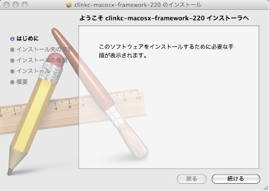
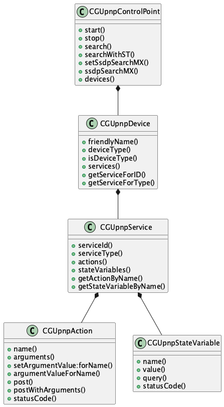

# Programming Guide for Objective-C

This document describes how to use the mUPnP for Objective-C to create your UPnP™ devices and control points.

## 1 Introduction

UPnP™\*[^1] architecture is based on open networking to enable discovery and control of networked devices and services, such as media servers and players at home.

UPnP™ architecture is based on many standard protocols, such as GENA, SSDP, SOAP, HTTPU and HTTP. Therefore you have to understand and implement these protocols to create your devices of UPnP™.

mUPnP for MacOSX is a development package for UPnP™ developers. The mUPnP controls these protocols automatically, and supports to create your control points quickly.

Please see the following site and documents to know about UPnP™ in more detail.

| Document                                               | URL                                                                       |
|----------------------------------------------------------|---------------------------------------------------------------------------|
| UPnP™ Forum                                            | http://www.upnp.org/                                                      |
| Universal Plug and Play Device Architecture            | http://www.upnp.org/download/UPnPDA10_20000613.htm                        |
| Universal Plug and Play Vendor\'s Implementation Guide | http://www.upnp.org/download/UPnP_Vendor_Implementation_Guide_Jan2001.htm |

## 2 Setup

### 2.1 System Requirement

Currently, the framework is based on Objective-C 2.0. Thus, the current framework requires MacOSX v10.5, Leopard, later. In the future, I will support other lower MacOSX and iPhone v2.0.

### 2.2 Installer

The framework is distributed as a install package as the following. Using the installer, the framework is installed into \'/Library/Framework/mUPnP.framework\' as default.



## 3 Control Point

### 3.1 Class Overview

The following static structure diagram is related classes of mUPnP to create your control point of UPnP™. The control point has some root devices in the UPnP™ network.



### 3.2 Initiating

To create a UPnP™ control point, create a instance of CGUpnpControlPoint class. The new instance is activated automatically using CGUpnpControlPoint::start. Use CGUpnpControlPoint::search or searchWithST to find the devices in the local network.

```
#import <mUPnP/UPnP.h>
......
CGUpnpControlPoint *ctrlPoint = [[CGUpnpControlPoint alloc] init];
......
[ctrolPoint search];
```

### 3.3 Root Devices

Use CGUpnpControlPoint:devices to get the all root devices which the control point found. The method returns a NSArray object which has the devices as instances of CGUpnpDevice.

```
#import <mUPnP/UPnP.h>
......
CGUpnpControlPoint \*ctrlPoint = [[CGUpnpControlPoint alloc] init];
......
[ctrolPoint search];

NSArray *devArray = [ctrlPoint devices];
for (CGUpnpDevice *dev in devArray)
    NSLog(@"%@", [dev friendlyName]);
```

### 3.4 Control

The control point can send action or query control messages to the discovered devices. To send the action control message, use CGUpnpAction:setArgumentValue:forName and CGUpnpAction:post. You should set the action values to the all input arguments, and the output argument values is ignored if you set. The following sample posts a action control request that sets a new time, and output the response result.

```
CGUpnpDevice *clockDev = .....
CGUpnpService *timeService = [clockDev getServiceForType:@"urn:schemas-upnp-org:service:xxxxx:1"];
CGUpnpAction *setTimeAct = [timeService getActionForName:@"SetTime"];

NSString *currTime = ......
[setTimeAct setArgumentValue: currTime forName:@"NewTime"];
if ([setTimeAct post]) {
    NSArray \*argArray = [ setTimeAct arguments]; for (CGUpnpArgument \*arg in argArray)
    NSLog(@"%@ = %@", [arg name], [arg value]]);
}
```

Similarly, to send the query control message, use CGUpnpStateVariable::query. The following sample posts a query control request, and output the return value.

```
CGUpnpDevice *clockDev = ......
CGUpnpService *timeService = [clockDev getServiceForType:@"urn:schemas-upnp-org:service:xxxxx:1"];
CGUpnpStateVariable *timeStateVar = [timeService "time"]; 
if ([timeStateVar query])
    NSLog(@"%@ = %@", [timeStateVar name], [timeStateVar value]]);
```
