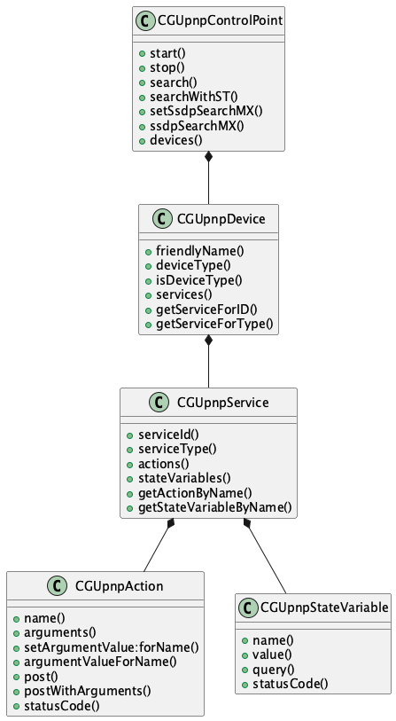

# Programming Guide for Objective-C

This document describes how to use the mUPnP for Objective-C to create your UPnP™ devices and control points.

## 1 Introduction

UPnP™\*[^1] architecture is based on open networking to enable discovery and control of networked devices and services, such as media servers and players at home.

UPnP™ architecture is based on many standard protocols, such as GENA, SSDP, SOAP, HTTPU and HTTP. Therefore you have to understand and implement these protocols to create your devices of UPnP™.

mUPnP for Objective-C is a development package for UPnP™ developers on macOS and iOS. The mUPnP controls these protocols automatically, and supports to create your control points quickly.

Please see the following site and documents to know about UPnP™ in more detail.

| Document                                               | URL                                                                       |
|----------------------------------------------------------|---------------------------------------------------------------------------|
| UPnP™ Forum                                            | http://www.upnp.org/                                                      |
| Universal Plug and Play Device Architecture            | http://www.upnp.org/download/UPnPDA10_20000613.htm                        |
| Universal Plug and Play Vendor\'s Implementation Guide | http://www.upnp.org/download/UPnP_Vendor_Implementation_Guide_Jan2001.htm |

## 2 Setup

### 2.1 System Requirement

The Xcode projects target macOS 12.0 or later and iOS 15.0 or later. The wrapper sources in `wrapper/objc/mUPnP` use manual reference counting (MRC); the Xcode project compiles them with `-fno-objc-arc`, so add the same flag when you build them in an ARC target.

### 2.2 Building

Build the framework with `wrapper/objc/xcode/mUPnP4ObjC.xcodeproj`. The project builds the C library through `lib/macosx/xcode/libmupnp.xcodeproj` and links it into the `mUPnP4ObjC` framework. To use the sources directly, add `wrapper/objc/mUPnP/*.m` to your target and add `include` and `wrapper/objc` to the header search paths.

The `mUPnP4ObjCTests` target contains XCTest cases for the wrapper. `test/security/verify-macos.py` builds the wrapper with ASan/UBSan and runs the Objective-C lifetime and API regressions together with the C test suite.

## 3 Control Point

### 3.1 Class Overview

The following static structure diagram is related classes of mUPnP to create your control point of UPnP™. The control point has some root devices in the UPnP™ network.



### 3.2 Initiating

To create a UPnP™ control point, create a instance of CGUpnpControlPoint class. The new instance is activated automatically using CGUpnpControlPoint::start, and `init` returns nil when the control point cannot be created or started. Use CGUpnpControlPoint::search or searchWithST to find the devices in the local network.

`search` sends an M-SEARCH request with the search target `upnp:rootdevice`; use `searchWithST:` with `ssdp:all` or another target to search for other devices. The methods return once the request has been sent and do not wait for responses (unless the wrapper is compiled with `CG_UPNPCONTROLPOINT_ENABLE_SEARCH_SLEEP`, which waits for `ssdpSearchMX` seconds). Found devices are reported asynchronously through the `CGUpnpControlPointDelegate` methods and are returned by `devices` afterwards.

```
#import <mUPnP/CGUpnp.h>
......
CGUpnpControlPoint *ctrlPoint = [[CGUpnpControlPoint alloc] init];
......
[ctrlPoint search];
```

On iOS, the application that uses the control point needs a `NSLocalNetworkUsageDescription` entry, and sending SSDP multicast requires the multicast networking entitlement. Configure them in the application; the framework does not change entitlements or signing settings.

### 3.3 Root Devices

Use CGUpnpControlPoint:devices to get the all root devices which the control point found. The method returns a NSArray object which has the devices as instances of CGUpnpDevice. Each device is an independent snapshot taken when the method is called; it keeps its description after the device leaves the network, and it is not updated by later discovery or events.

```
#import <mUPnP/CGUpnp.h>
......
CGUpnpControlPoint *ctrlPoint = [[CGUpnpControlPoint alloc] init];
......
[ctrlPoint search];
// Wait for responses, for example in the delegate callbacks.

NSArray *devArray = [ctrlPoint devices];
for (CGUpnpDevice *dev in devArray)
    NSLog(@"%@", [dev friendlyName]);
```

### 3.4 Control

The control point can send action or query control messages to the discovered devices. To send the action control message, use CGUpnpAction:setArgumentValue:forName and CGUpnpAction:post, or CGUpnpAction:postWithArguments. You should set the action values to the all input arguments, and the output argument values is ignored if you set. The following sample posts a action control request that sets a new time, and output the response result.

```
CGUpnpDevice *clockDev = .....
CGUpnpService *timeService = [clockDev getServiceForType:@"urn:schemas-upnp-org:service:xxxxx:1"];
CGUpnpAction *setTimeAct = [timeService getActionForName:@"SetTime"];

NSString *currTime = ......
[setTimeAct setArgumentValue:currTime forName:@"NewTime"];
if ([setTimeAct post]) {
    NSDictionary *args = [setTimeAct arguments];
    for (NSString *name in args)
        NSLog(@"%@ = %@", name, [args objectForKey:name]);
}
else {
    NSLog(@"UPnP status code = %ld", (long)[setTimeAct statusCode]);
}
```

`postWithArguments:` checks every entry before it changes any argument or sends the request. It returns NO without sending anything when a key is not an argument name of the action, or when a key or value is not an `NSString`. Arguments that are not in the dictionary keep their current values.

```
if (![setTimeAct postWithArguments:@{ @"NewTime" : currTime }])
    NSLog(@"SetTime failed");
```

Similarly, to send the query control message, use CGUpnpStateVariable::query. The following sample posts a query control request, and output the return value.

```
CGUpnpDevice *clockDev = ......
CGUpnpService *timeService = [clockDev getServiceForType:@"urn:schemas-upnp-org:service:xxxxx:1"];
CGUpnpStateVariable *timeStateVar = [timeService getStateVariableForName:@"Time"];
if ([timeStateVar query])
    NSLog(@"%@ = %@", [timeStateVar name], [timeStateVar value]);
```

The SDK reports the result of each request but does not ask the user for confirmation or retry requests automatically. Applications that control real devices are responsible for confirming operations and for deciding whether to resend them.

### 3.5 Descriptions

CGUpnpDevice:parseXMLDescription and CGUpnpService:parseXMLDescription pass the description to the parser as UTF-8 bytes, so names that contain Japanese text or emoji are kept. They return NO without changing the receiver for nil, empty or non-UTF-8 input. When the XML itself is rejected, they return NO after the previous description has been cleared; do not use service, action or state variable objects obtained from the receiver before the failed call.
